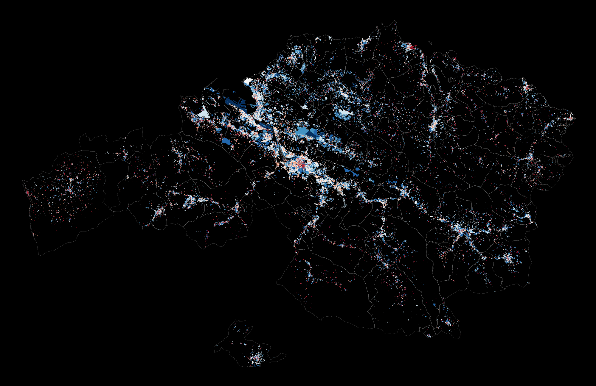

# Bizkaiko etxeak

## (Houses of Biscay)

Bizkaiko etxeak is an interactive web map where the houses of [Biscay](https://en.wikipedia.org/wiki/Biscay) (Basque Country) are depicted based on their construction date. The map data was taken from the [website of the cadastre of Biscay](http://www.bizkaia.eus/home2/Temas/DetalleTema.asp?Tem_Codigo=5181&Idioma=IN). Although the data is open access, its property and reusing rights are not, so there is no data in the repository, only the necessary code and instructions to create the map itself. That's why some directories only have gitignore files: to preserve directory structure while ignoring protected data.

**[Live map](http://bizkaikoetxeak.iturbe.info)**



## Getting Started

These instructions will show you the steps followed to create the aforementioned map. First, clone the git repository:

```
$ git clone git://github.com/mikeliturbe/bizkaiko-etxeak.git
```
### Data wrangling

Raw cadastre data requires preprocessing. All steps for data retrieval and manipulation are explained in a [Jupyter notebook](data_wrangling/bizkaiko-etxeak.ipynb). To get the notebook up and running in a virtual environment:

```
$ cd data_wrangling
$ pip install -r requirements.txt
$ jupyter notebook
```

Follow the notebook instructions to create the map shapefiles. Final shapefiles will be located in the *data/results* directory.

### Map creation
- Install [Tilemill](https://github.com/tilemill-project/tilemill).
- Copy the Tilemill project data from the repository to the Tilemill saves directory (*~/Documents/MapBox/project/* by default)
```
$ cd tilemill_project
$ mkdir ~/Documents/Mapbox/project/bizkaiko-etxeak
$ cp -r * ~/Documents/Mapbox/project/bizkaiko-etxeak/
```
- Copy the shapefiles generated with the Jupyter Notebook to the layers directory inside the Tilemill project directory.
```
$ cd data/results
$ cp all_buildings* ~/Documents/Mapbox/project/bizkaiko-etxeak/layers/allbuildings/
$ cp all_boundaries* ~/Documents/Mapbox/project/bizkaiko-etxeak/layers/allboundaries/
```
- Open Tilemill and the project should appear there.
- By using [CartoCSS](https://tilemill-project.github.io/tilemill/docs/manual/carto/) you can customize the appearance of the map. For this map, the color of building shapes were chosen according to their construction date. Colors were chosen using [ColorBrewer](http://colorbrewer2.org/).

### Map deployment

- Export project MBTiles using Tilemill (*Export > MBTiles*). 
- Convert MBTiles to images with [MBUtil](https://github.com/mapbox/mbutil)
```
$ mb-util --image_format=png name_of_file.mbtiles bizkaiko-etxeak
```
- Upload the created image tile directory to a web server.
- Change *web_files/index.html* to point to the domain and directory hosting the map tiles.
- Upload the contents of the *web_files* directory to the web server. 
- Access the website with a web navigator. The map should be online.

## Built With

- [Pandas](http://pandas.pydata.org/), [Pyshp](https://pypi.python.org/pypi/pyshp), [Jupyter notebook](http://jupyter.org/) - Data wrangling
- [Tilemill](https://github.com/tilemill-project/tilemill) - Map design
- [MBUtil](https://github.com/mapbox/mbutil) - MBTiles exporter
- [Mapbox.js](https://www.mapbox.com/mapbox.js/api/v2.4.0/) - Javascript map library

## Authors

* **Mikel Iturbe** - [mikeliturbe](https://github.com/mikeliturbe)

## License

* This project is licensed under the MIT License - see the [LICENSE](LICENSE) file for details

## Acknowledgments

* Project inspired by [this Dutch map](http://code.waag.org/buildings/)
